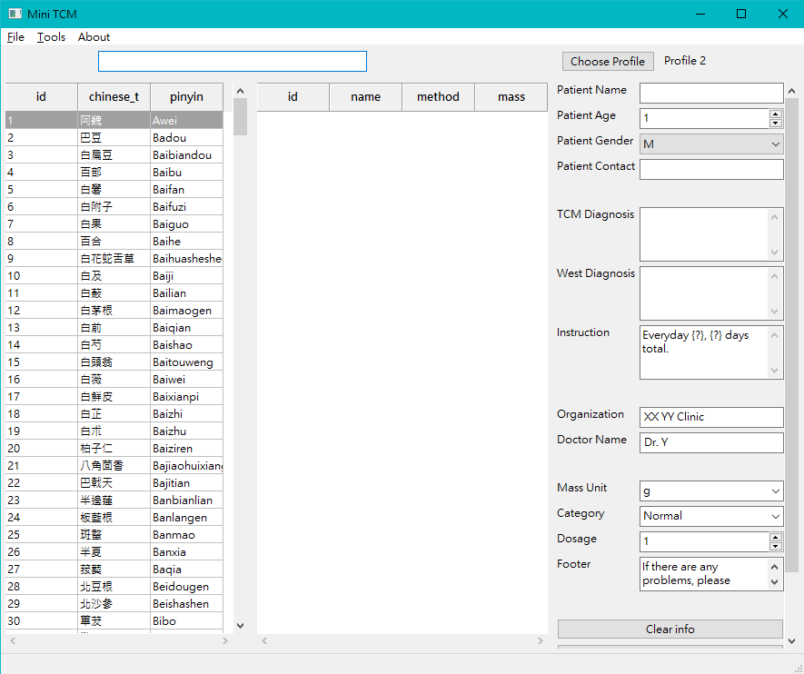

# MiniTCM
A very mini/simple script (PDF) writer for Traditional Cchinese Medidine (TCM). 

<br>
<br>
<br>


## Installation
---
Here are built executables for Windows 10 and Ubuntu 20.04:

[windows-exe]()

[ubuntu-exe]()

**Tips**: You can create shortcut to executable on ~/Desktop.
If the above executables does not suit you, you can build them by yourself or just run the python code without touching PyInstaller.

### Build executable:
---
*Currently the author is having some trouble building under macOS.*

Install packages.
```
pip3 install -r requirements/dev.txt
```
Use [PyInstaller](https://www.pyinstaller.org/) 

Make spec. 

For Windows, use `;` inside `--add-data` argument. 

For Ubuntu and macOS, use `:` inside `--add-data` argument. 
```
pyi-makespec run.py \
	--windowed \
	--name "MiniTCM" \
	--add-data "./minitcm/resources;minitcm/resources" 
```
Build.
```
pyinstaller MiniTCM.spec
```
Run.
```
./dist/MiniTCM/MiniTCM.exe    # Windows
# or 
./dist/MiniTCM/MiniTCM        # Ubuntu
# or 
./dist/MiniTCM/MiniTCM.app    # macOS
```

### Use as code:
---
Install packages.
```
pip3 install -r requirements/common.txt
```
Run code.
```
python3 app.py
```
Note: It is OK to modify the code to suit your own preference.

## Notes
---
The application code is tested on Windows 10 (1909), Ubuntu (20.04), macOS (Sierra).

The application build is tested on Windows 10 (1909), Ubuntu (20.04).

 ## Tips
 ---

You can create shortcut to executable on ~/Desktop.

If you encounter encoding errors, might be related to: [PYTHONUTF8](https://docs.python.org/3/using/cmdline.html#envvar-PYTHONUTF8)

If you are using [PyInstaller](https://www.pyinstaller.org/) inside [pyenv](https://github.com/pyenv/pyenv), the following links is worth reading:
* [How to build CPython with ...](https://github.com/pyenv/pyenv/wiki#how-to-build-cpython-with---enable-shared)
* [pyenv and PyInstaller](https://pyinstaller.readthedocs.io/en/stable/development/venv.html)


## Future
---
* Add github release / upload sample executables.
* Help/Manual/Wiki.
* Add translations.
* Support templates for reportlab.
* Wheels? Maybe.
* As a package on PYPI? A very distant future.
* Higher customisability for fields and stuff.
